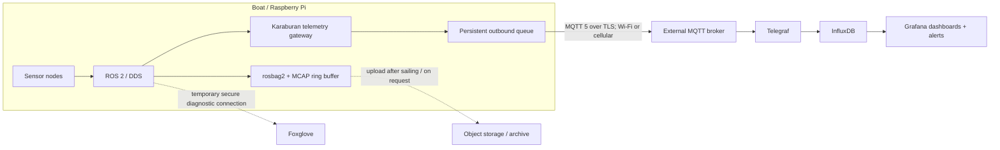
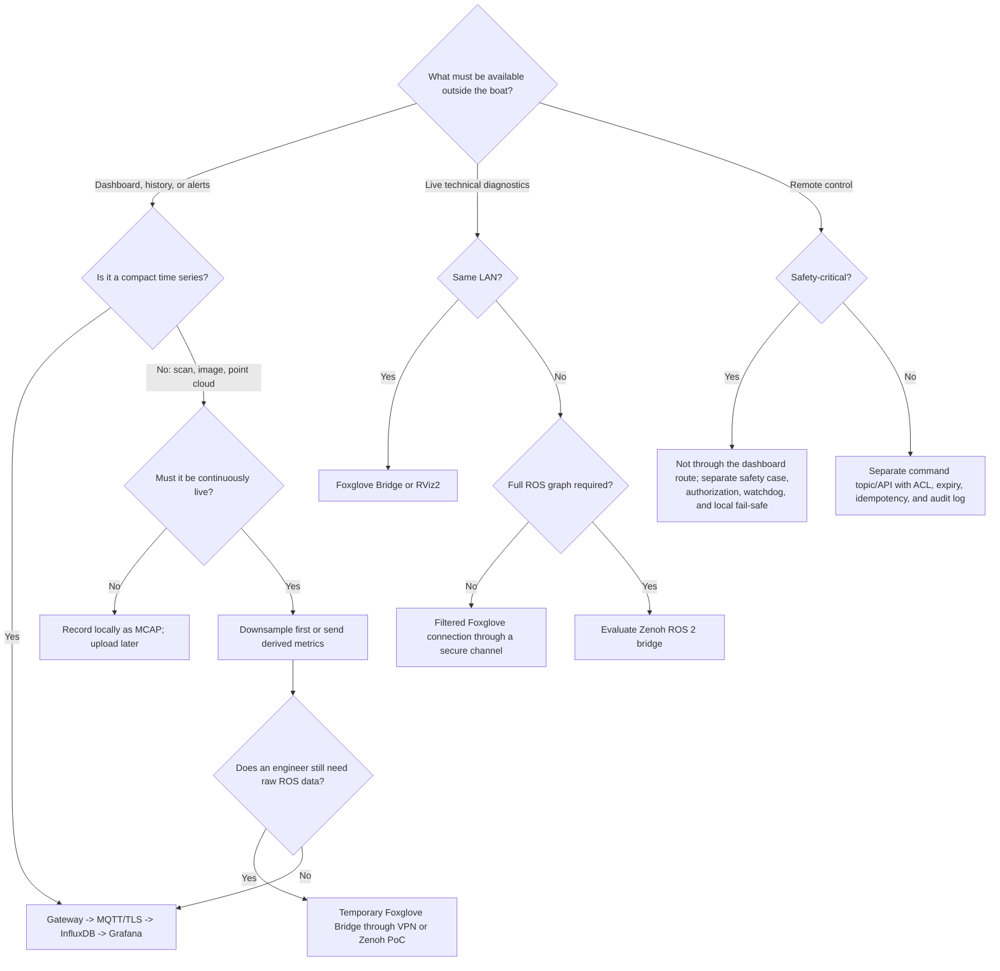

# Implementation plan: storing and visualizing sensor data outside the boat

Status: recommendation for the current ROS 2 Jazzy code in this repository,
prepared on July 17, 2026.

## 1. Summary recommendation

Keep ROS 2 and DDS inside the boat and create a clear boundary between the local
control network and the internet. Send only selected telemetry from an edge
gateway on the Raspberry Pi through an **outbound MQTT connection with TLS** to
a broker outside the boat. Use Telegraf to write the messages to InfluxDB and
visualize them with Grafana. In addition, record selected ROS topics locally as
compressed MCAP files. Use Foxglove for engineering, live diagnostics, and
reviewing MCAP recordings.

For an initial no-host pilot, MQTT can temporarily be omitted: use HTTPS and a
local retry queue to write directly to InfluxDB Cloud Free. Section 4 compares
this route with the eventual MQTT architecture.

This fits well with what is already in the repository:

- ROS 2 Jazzy publishes `/fix`, `/temperature`, `/sonar`, `/scan`,
  `/tof/distance`, `/bt785`, and navigation data, among other topics;
- the `python/` directory already publishes JSON to `karaburan/sensors/...` via
  MQTT;
- `mosquitto/` and `influxdb/` already contain a proof of concept for
  MQTT -> Telegraf -> InfluxDB;
- Grafana is still missing, and the current broker configuration is suitable
  only for local experiments: anonymous access, no TLS, and QoS 0.

The recommended architecture is:



Crucially, the data connection must be able to fail without affecting navigation
or local safety. The boat initiates the external connection itself; no port on
the Raspberry Pi needs to be exposed to the internet.

## 2. Options in and around the ROS ecosystem

| Option | Suitable for | Wi-Fi/LAN | Cellular data/WAN | History | Recommendation |
|---|---|---:|---:|---:|---|
| ROS 2 DDS directly | ROS nodes on a trusted local network | Good | Poor because of discovery, multicast, NAT, changing addresses, and unstable connections | No | Use only on board or on a local service network |
| DDS over VPN | Temporary full ROS access for engineers | Fair | Possible, but bandwidth and discovery still require attention | No | Diagnostic path, not the primary telemetry pipeline |
| Fast DDS Discovery Server / DDS Router | DDS discovery or routing across separated networks | Good | Technically possible | No | Choose only when full, transparent ROS access is genuinely required |
| Zenoh ROS 2 bridge | Selected topics or the full ROS graph across routers/WAN | Good | Designed well for routed/geographically distributed connections | Not by itself | Strong candidate for phase 3; start with a proof of concept |
| Foxglove Bridge | Live ROS visualization and diagnostics in Foxglove | Good | Only through a secure tunnel/managed connection and with topic filters | MCAP separately | Recommended engineering tool, not the database |
| rosbridge_suite | Browser or custom web app through JSON/WebSocket | Good | Only behind TLS, authentication, and filtering | No | Use only if a custom interactive web UI needs ROS semantics |
| rosbag2 with MCAP | Complete, reproducible raw ROS recording | n/a | Upload the file later | Yes | Recommended for diagnostics and research |
| RViz2 | Robot status, TF, LaserScan, and maps | Good | Impractical without a full ROS connection | Limited through bag replay | Local and engineering use, not as a public dashboard |
| PlotJuggler | Live plots and bag analysis | Good | Not intended as an internet service | Through bags | Useful for engineers |
| InfluxDB + Grafana | Time series, GPS tracks, status, dashboards, and alerts | Good | Good behind a central ingestion layer | Yes | Recommended for everyday visualization |

ROS 2 uses DDS and Domain IDs to separate ROS networks logically; discovery uses
multicast by default. This works well on a LAN but is not a convenient internet
API. A Discovery Server reduces discovery traffic, but it does not solve
buffering, history, authentication, data costs, or interrupted connections.

Zenoh is useful if real ROS topics, services, and actions later need to be
available remotely. The ROS 2 DDS bridge can route the graph over Zenoh, add a
namespace per robot, and filter routes. This is much better suited to WAN than
raw DDS, but it introduces a second middleware layer that the team must manage
and test. It is therefore unnecessary for the first dashboards.

Foxglove Bridge preserves ROS message schemas and is therefore more convenient
than rosbridge for live technical visualization. Rosbridge exposes ROS
capabilities as JSON through a WebSocket protocol and is most useful when a
custom browser app must read or write topics. Neither replaces durable storage
or store-and-forward delivery.

MCAP is a rosbag2 storage plugin and can be used with normal `ros2 bag` commands.
Zstd chunk compression keeps files compact while still allowing tools to read
specific parts efficiently. For a Raspberry Pi, `zstd_fast` is a sensible
starting point; measure CPU load and write speed on the actual hardware.

## 3. What are MCAP and Foxglove?

### MCAP files

An MCAP file is an open container format for timestamped logged messages. Think
of it as a flight data recorder for the boat, not as a database. One file can
contain GPS, temperature, sonar, LiDAR, TF, and other ROS topics at the same
time. Message schemas are embedded in the file, so a recording can still be
interpreted later without reconstructing the exact same workspace.

MCAP is useful for this project because it:

- writes append-only and is therefore suitable for recording on an edge device;
- can contain indexes for quickly seeking to a time or topic;
- can compress chunks with Zstandard or LZ4;
- makes partially written files more recoverable after a power failure;
- can be read directly by rosbag2 and Foxglove;
- preserves the original ROS messages, whereas InfluxDB contains only selected
  and normalized measurements.

An example recording command is:

```bash
ros2 bag record -s mcap \
  --storage-preset-profile zstd_fast \
  /fix /temperature /sonar /bt785 /scan /tf /tf_static
```

Do not record `--all` indefinitely. Split files by time or size, reserve free
disk space for the OS, and use a ring buffer. An MCAP file is not copied off the
boat automatically; that requires an upload step, Foxglove Agent, or an object
storage client. Upload large files over Wi-Fi by default.

### Foxglove

Foxglove is a viewer and data platform for robotics data. It understands ROS
schemas and can show time plots, maps, 3D scenes, images, raw messages,
parameters, TF, and the topic graph side by side. For many diagnostic tasks, it
therefore replaces a combination of RViz, separate plotting tools, and a custom
debug UI.

There are three distinct ways to use it:

1. **Local file:** open an `.mcap` file from the laptop in Foxglove. Nothing needs
   to be hosted, and the Raspberry Pi does not need to be online.
2. **Live on the same network:** run `foxglove_bridge` as a ROS 2 node on the Pi
   and connect the Foxglove desktop or web app to its WebSocket. This is suitable
   for local Wi-Fi, but the bridge port must not be exposed publicly on the
   internet.
3. **Through Foxglove Cloud:** upload recordings to the Data Platform or use
   Remote Access. The gateway on the boat then initiates an outbound connection;
   no public IP address or port forwarding is needed. Remote Access is currently
   a paid Pro/Enterprise feature and uses WebRTC to deal with NAT, cellular
   networks, and packet loss.

Foxglove is primarily suited to engineering and raw multimodal data. Grafana is
better for a straightforward operational dashboard, long time series, and
alerts. Using both is not duplication: they answer different questions.

## 4. Hosting and inexpensive existing services

The server does not need to be geographically close to the boat. Reliability is
more important than millisecond latency for telemetry. Prefer an EU region if
GPS tracks or research policy require it. Keep large raw files local and upload
them over Wi-Fi by default.

### Network requirements

- The boat needs working DNS, an accurate clock, and outbound internet access.
- Managed services require neither a public IP address nor an inbound firewall
  rule on the boat.
- Use outbound HTTPS on TCP 443 for InfluxDB/Foxglove and MQTT over TLS on TCP
  8883 or the provider's designated port.
- Never expose the current anonymous Mosquitto listener on port 1883 to the
  internet.
- Create per-boat tokens with write access only to that boat's data, store them
  outside Git, and ensure that each token can be revoked independently.
- A cloud service does not make a cellular connection reliable; the local queue
  remains necessary.

### Current inexpensive options

Prices and limits are a snapshot from July 17, 2026 and must be checked again at
implementation time.

| Service/route | Free or inexpensive entry tier | Useful for | Limitation |
|---|---|---|---|
| Foxglove Free | $0; 10 GB, 3 users, 1 project, 5 devices | Sharing and analyzing MCAP | 1 query hour/month; no Remote Access |
| Foxglove Pro | From $20/month; 1 TB and 3 developer seats | Recordings and live remote access | Includes 300 minutes/device/month, then usage charges |
| Foxglove Academic | $0 if accepted; 1 TB storage | Research and MCAP | Check eligibility; Remote Access is not listed as included |
| InfluxDB Cloud Free | $0; limited ingestion/query, 30-day retention, 2 buckets | External time-series storage over HTTPS | No long-term history or SLA; quotas may reject writes |
| Grafana Cloud Free | $0; 3 active users | Managed dashboards | InfluxDB remains a separate data source |
| HiveMQ Serverless | $0; 100 connections, 10 GB/month | MQTT/TLS pilot | No SLA; database consumer still required separately |
| EMQX Serverless | 1 million session minutes and 1 GB/month free | MQTT/TLS with ACL and QoS | No durable sessions; database consumer still required separately |
| Small EU VPS | Budget EUR 5-15/month | Entire open-source stack | You manage updates, TLS, backups, and recovery |

### Route A - no server of your own, fastest free pilot

```text
ROS 2 -> gateway + local SQLite queue
      -> HTTPS batches -> InfluxDB Cloud Free
      -> Grafana Cloud Free or InfluxDB dashboard

ROS 2 -> local MCAP -> Foxglove locally / Free upload over Wi-Fi
```

MQTT is temporarily omitted in this route. The gateway writes batches to the
official InfluxDB HTTPS write API. This uses the fewest components and quickly
shows whether the schema and dashboards are correct. Use a token for one bucket
and handle HTTP 429, 5xx, and quota errors with backoff. Choose this when the
initial need is limited to storage and visualization.

### Route B - target architecture with MQTT

```text
ROS 2 -> gateway + local SQLite queue
      -> MQTT/TLS -> Mosquitto -> Telegraf -> InfluxDB -> Grafana
```

For a cohesive pilot, one small EU VPS is often simpler than three separate
managed services. As a starting point, use 2 vCPU, 4 GB RAM, and a 40 GB SSD,
measure actual usage, and do not put MCAP on the same small system disk. The
current Compose files are a useful base, but they must be combined and hardened;
Grafana and a TLS reverse proxy are still missing.

A free HiveMQ or EMQX broker is useful for testing MQTT, but it does not complete
the pipeline: Telegraf or another consumer must still continuously write to
InfluxDB. Do not run that consumer exclusively on the boat, because external
persistence would then depend on the Pi again.

### Recommended choice

1. First check whether **Foxglove Academic** is available for the project.
2. Always use Foxglove locally for MCAP and try Free/Academic for sharing a few
   recordings.
3. Start with Route A to create GPS and sensor dashboards quickly without server
   administration.
4. Move to Route B when 30-day retention is too short, MQTT consumers are
   needed, or the platform becomes operationally important.
5. Only adopt Foxglove Pro when live remote diagnostics are genuinely required;
   local, Free, or Academic is sufficient for recordings alone.

## 5. Decision tree

Use this decision tree for each information need or topic; one product does not
need to carry every kind of data.



Additional hosting guidance:

- **One boat and a small team:** start with a small VPS or existing
  infrastructure running Mosquitto, Telegraf, InfluxDB OSS 2.x, and Grafana.
- **No desire to administer systems:** choose managed MQTT plus a managed
  time-series or observability service; validate retention, exportability, and
  costs in advance.
- **Multiple boats:** add `boat_id` from day one, give each boat its own
  credentials/ACLs, and do not grant shared write access for the entire fleet.
- **Long-term retention of raw recordings:** use object storage for MCAP, not
  InfluxDB. Store only queryable measurements and derived values in InfluxDB.

## 6. What should be reused and what should be built?

### Use existing components

Do not build these yourself:

- MQTT broker, TLS, user management, and ACL mechanism: Mosquitto or a managed
  broker;
- time-series database: InfluxDB;
- dashboards, map views, and alerts: Grafana has a built-in InfluxDB data source
  and a Geomap panel for latitude/longitude and routes;
- complete ROS recordings: rosbag2 with MCAP;
- live ROS inspection: Foxglove Bridge, RViz2, and optionally PlotJuggler;
- generic WAN routing of the ROS graph: a Zenoh bridge or DDS router, if the need
  is demonstrated later;
- cryptography, VPN, and identity provider: use proven software; do not design a
  custom protocol or encryption scheme.

### Build one small project-specific component

Build one **`karaburan_telemetry_gateway` ROS 2 package**. This node:

1. explicitly subscribes to an allowlist of ROS topics;
2. converts ROS messages to a versioned telemetry schema;
3. reduces frequencies and computes aggregates where appropriate;
4. first writes to a bounded, persistent local queue;
5. then publishes asynchronously to the external broker;
6. removes data only after acknowledgment and can resume after reconnecting;
7. publishes its own health metrics, such as queue size, oldest message, uptime,
   signal strength, bytes sent, and last broker contact.

This is deliberately custom because topic selection, measurement semantics,
downsampling, and priority require Karaburan domain knowledge. Keep it small: do
not recreate a database, dashboard engine, custom WebSocket protocol, or generic
ROS bridge.

### What is too difficult or risky for the first version

- **Full DDS over cellular internet:** discovery and arbitrary data streams are
  difficult to constrain; NAT, roaming, jitter, and packet loss make behavior
  unpredictable.
- **Building a generic ROS-to-web bridge:** rosbridge and Foxglove Bridge already
  solve serialization and schemas.
- **Continuously sending all LiDAR data to the cloud:** high-frequency `/scan`
  data is expensive and adds little value to an operational dashboard. Send, for
  example, the minimum distance per sector, alarm status, and a 1 Hz summary;
  retain raw scans locally in MCAP.
- **Promising exactly-once transport:** MQTT QoS 1 is at-least-once and can
  deliver duplicates. Make messages idempotent with a unique key and deduplicate
  during ingestion. This is more reliable than a custom transport protocol.
- **Mixing remote control with telemetry:** commands require a separate threat
  analysis, authorization, expiry, acknowledgments, a watchdog, and a local
  fail-safe. Permission to visualize does not imply permission to control.
- **Using SROS2 as the only internet security:** SROS2 can secure DDS identities
  and topic permissions, but it does not replace a WAN gateway, firewall,
  buffering, or fleet management. Managing keystores and policies is also a
  separate project.

## 7. Data contract

Define a stable, independent WAN schema before implementation. For example:

```json
{
  "schema_version": 1,
  "message_id": "01J...",
  "boat_id": "karaburan-01",
  "sensor_id": "28.C23646D48524",
  "type": "temperature",
  "event_time": "2026-07-17T12:34:56.123Z",
  "sequence": 18342,
  "unit": "degC",
  "value": 18.7,
  "quality": "ok",
  "source_topic": "/temperature"
}
```

For GPS, separate numeric fields for `latitude`, `longitude`, `altitude`,
`speed`, `track`, and fix quality are preferable to the current complete gpsd
object under `value`. Avoid using sensor ID, boat ID, and other identifiers as
InfluxDB fields; use a controlled number of tags. Do not put unbounded values
such as a timestamp or `message_id` in tags, because high cardinality places an
unnecessary load on the database.

Recommended topics:

```text
karaburan/v1/boats/<boat_id>/telemetry/<type>/<sensor_id>
karaburan/v1/boats/<boat_id>/state
karaburan/v1/boats/<boat_id>/events
karaburan/v1/boats/<boat_id>/gateway/health
```

Use retained messages only for current configuration/status, not for every
measurement. Choose QoS 1 for events, health, and telemetry that must not be
missed, and configure a persistent session. Account for duplicates. QoS 0 can be
an intentional choice for high-frequency, replaceable live samples. In every
case, the local queue remains the recovery source after a prolonged outage.

## 8. Execution plan

### Phase 0 - requirements and measurement budget (1-2 days)

1. Inventory every ROS topic with its type, frequency, and average and peak
   message size (`ros2 topic hz` and `ros2 topic bw`).
2. Classify topics as operational telemetry, event/alarm, raw diagnostics, or
   command.
3. For each topic, record the desired external frequency, maximum age,
   retention, priority, and behavior when local storage is full.
4. Define a cellular data budget. Calculate the payload plus approximately
   30-50% overhead and measure it later on the real connection.
5. Define SLOs, for example: while connected, 95% of compact telemetry is
   visible within 10 seconds; no priority-1 data is lost after 24 hours offline;
   a dashboard always shows the age of the latest measurement.

**Decision point:** if only live engineering on the same Wi-Fi network is
required, Foxglove Bridge is sufficient for now. Continue with phase 1 as soon
as history or internet access is needed.

### Phase 1 - secure external MVP over Wi-Fi (3-5 days)

1. Choose Route A for the fastest no-host pilot, or, for Route B, deploy
   Mosquitto, Telegraf, InfluxDB, and Grafana outside the Pi on a development
   server or VPS.
2. For Route B, close the current public configuration: set
   `allow_anonymous false`, create an identity per boat, configure topic ACLs,
   and offer only MQTT over TLS.
3. Remove passwords and tokens from Compose files; use secrets or runtime
   configuration. The current values `admin123` and `token` are development
   values and must be replaced.
4. Initially implement the gateway for temperature, GPS, conductivity, and
   gateway health. Use JSON for the MVP; optimize only after measuring.
5. Create Influx measurements and Grafana panels for:
   - latest position and sailed route on a Geomap;
   - temperature and conductivity as time series;
   - sensor status and age of the latest measurement;
   - battery/CPU/storage/network when available;
   - offline and threshold alerts.
6. Synchronize time with NTP when connected and always retain both `event_time`
   and server-side `ingest_time`.

**Acceptance:** broker port 1883 is not externally reachable; an unauthorized
boat cannot write to another boat's topics; charts remain correct after
duplicate messages; timestamps come from the measurement, not Telegraf.

### Phase 2 - offline-first and raw data (3-5 days)

1. Add a transactional, bounded local queue, for example SQLite with WAL. Write
   before publishing; acknowledge and delete in batches.
2. Define a storage-pressure policy: delete old priority-3 telemetry first and
   never allow silent corruption; publish a visible `data_loss` event if data is
   deliberately removed.
3. Add backoff with jitter and prevent reconnect storms.
4. Record selected topics locally with rosbag2/MCAP, split by time or size. Start
   with `zstd_fast` and a bounded ring buffer.
5. Upload closed MCAP segments only over Wi-Fi or explicitly on request over
   cellular; use checksums and resumable uploads.
6. Test by repeatedly disabling and restoring the connection during a trip.

**Acceptance:** survive at least the agreed offline period, catch up in order
without unbounded RAM use, do not block ROS callbacks, and show a visible backlog
indicator in Grafana.

### Phase 3 - cellular connection (2-4 days plus field test)

1. Use the same MQTT/TLS route; the application must not depend on the uplink
   type.
2. Measure data usage per message type and configure a profile for each
   connection: `wifi`, `cellular-good`, `cellular-poor`, and `offline`.
3. On cellular, reduce GPS to 1 Hz or less for the dashboard, for example,
   temperature to once per 15-60 seconds, and LiDAR to events/aggregates.
4. Tune keepalive, connection timeout, inflight limit, and batch size for high
   latency and changing coverage.
5. Add modem metrics: connection type, signal, provider, bytes sent, and
   reconnects. Do not publish sensitive modem identifiers in dashboards.
6. Field-test loss of coverage, IP changes, roaming, a full queue, reboot during
   an upload, and an incorrect clock.

**Decision point:** only start a Zenoh/Foxglove trial if engineers can
demonstrate that they still need complete ROS topics remotely. Do not make the
telemetry pipeline depend on it.

### Phase 4 - optional live ROS diagnostics (2-5 day proof of concept)

1. Compare two constrained options:
   - Foxglove Bridge behind a VPN/identity-aware tunnel with a topic allowlist;
   - a Zenoh ROS 2 bridge on the boat and a bridge/router on shore, with only
     explicitly permitted routes.
2. Test `/fix`, `/temperature`, `/sonar`, and temporarily `/scan`; measure
   discovery, idle, and payload traffic.
3. Verify reconnection behavior, a namespace per boat, and data limits.
4. Give external users read-only access by default. Publishing to `/cmd_vel` and
   other actuator topics remains blocked.
5. Choose Zenoh only if transparent remote ROS tools justify the additional
   operational complexity. Choose rosbridge only when a custom web client
   genuinely needs ROS interaction.

### Phase 5 - production hardening (ongoing)

1. Pin container versions, automate backups, and run recovery tests.
2. Configure retention and downsampling: for example, retain high-resolution
   data for 30 days and hourly averages longer; align this with the research
   objective.
3. Rotate boat certificates/tokens and support revocation per boat.
4. Monitor the broker, Telegraf, InfluxDB, Grafana, disk space, certificate
   expiry, and missing data.
5. Version gateway configuration and Grafana provisioning in this repository,
   but do not commit secrets.
6. Perform a threat analysis before permitting any external command.

## 9. Initial concrete backlog

- [ ] Document the topic inventory and bandwidth measurements in
      `docs/telemetry-topics.md`.
- [ ] Check whether Foxglove Academic applies; otherwise use Free for a limited
      MCAP trial.
- [ ] Choose Route A or Route B and document the monthly limit.
- [ ] Set up an external development platform with secured Mosquitto.
- [ ] Create `karaburan_telemetry_gateway` as a ROS 2 Python package.
- [ ] Define telemetry schema v1 and its JSON Schema.
- [ ] Implement a SQLite queue with unique `message_id` and batch
      acknowledgment.
- [ ] Make the Telegraf mapping explicit; do not let arbitrarily nested JSON
      directly determine the InfluxDB schema.
- [ ] Add Grafana through provisioning with route, sensor, and health dashboards.
- [ ] Add an MCAP recording configuration with segmentation, limits, and
      `zstd_fast`.
- [ ] Create an integration test covering broker outages, duplicates, and a
      Raspberry Pi reboot.
- [ ] Run a Wi-Fi field test before activating the cellular profile.

## 10. Sources and verification

The principal technical choices were checked against primary documentation:

- [ROS 2 Jazzy: Domain ID and DDS networks](https://docs.ros.org/en/jazzy/Concepts/Intermediate/About-Domain-ID.html)
- [ROS 2: DDS traffic uses multicast for discovery by default](https://docs.ros.org/en/ros2_documentation/rolling/Tutorials/Advanced/Security/Examine-Traffic.html)
- [ROS 2: Fast DDS Discovery Server](https://docs.ros.org/en/rolling/Tutorials/Advanced/Discovery-Server/Discovery-Server.html)
- [ROS 2 Jazzy: SensorDataQoS is best-effort and volatile](https://docs.ros.org/en/ros2_packages/jazzy/api/rclcpp/generated/classrclcpp_1_1SensorDataQoS.html)
- [rosbag2 MCAP plugin and compression profiles](https://docs.ros.org/en/ros2_packages/kilted/api/rosbag2_storage_mcap/)
- [MCAP: open, self-contained container format](https://mcap.dev/)
- [Foxglove Bridge for live ROS 1/ROS 2 data](https://docs.foxglove.dev/docs/fleet/bridge)
- [Foxglove Remote Access](https://docs.foxglove.dev/docs/visualization/connecting/live/remote-access)
- [Foxglove pricing and quotas](https://docs.foxglove.dev/docs/pricing)
- [rosbridge_suite ROS 2 protocol](https://github.com/RobotWebTools/rosbridge_suite/blob/ros2/ROSBRIDGE_PROTOCOL.md)
- [Eclipse Zenoh ROS 2 DDS bridge](https://github.com/eclipse-zenoh/zenoh-plugin-ros2dds)
- [Telegraf MQTT consumer; persistent sessions at QoS 1/2](https://docs.influxdata.com/telegraf/v1/input-plugins/mqtt_consumer/)
- [Grafana InfluxDB data source](https://grafana.com/docs/grafana/latest/datasources/influxdb/)
- [Grafana Geomap for GPS and routes](https://grafana.com/docs/grafana/latest/visualizations/panels-visualizations/visualizations/geomap/)
- [Grafana Cloud pricing](https://grafana.com/pricing/)
- [InfluxDB Cloud plans](https://docs.influxdata.com/influxdb/cloud/account-management/pricing-plans/)
- [InfluxDB Cloud write API](https://docs.influxdata.com/influxdb/cloud/api/write-data/)
- [HiveMQ Cloud Serverless](https://www.hivemq.com/products/mqtt-cloud-broker/)
- [EMQX Serverless](https://docs.emqx.com/en/cloud/latest/price/plans.html)
- [ROS 2 Jazzy SROS2 keystores, identities, and policies](https://docs.ros.org/en/ros2_documentation/jazzy/Tutorials/Advanced/Security/The-Keystore.html)

## 11. Final decision

For Karaburan, **MQTT/TLS + a small ROS telemetry gateway + InfluxDB/Grafana**,
supplemented with **local MCAP recordings**, is the shortest path to a reliable
result over both Wi-Fi and cellular data. Foxglove belongs alongside it as an
engineering tool. Zenoh is the logical next step if full, interactive ROS access
over WAN later proves necessary. Direct DDS routing, a custom visualization
platform, or a custom generic bridge add more complexity and risk than value in
the first version. If server administration is currently undesirable, writing
directly to InfluxDB Cloud over HTTPS is a sensible temporary simplification;
MQTT can be introduced later.
